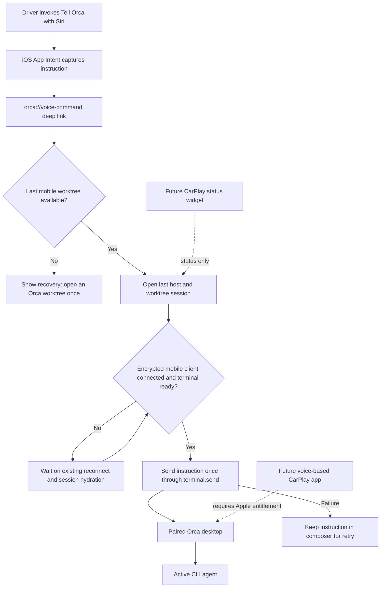

# Mobile voice and CarPlay integration

The first release exposes one narrow system action: **Tell Orca**. Siri captures an instruction,
opens Orca Mobile through its existing URL scheme, and sends the instruction to the terminal in the
last worktree visited on that phone. The existing mobile transport remains the only network and
encryption implementation.

## Current boundaries

- The desktop must be running and reachable through Orca's existing LAN or relay path.
- Siri launches the mobile app because the App Intent intentionally reuses the React Native session
  and encrypted transport rather than duplicating credentials or protocol code in Swift.
- The instruction is sent once per App Intent request ID. A failed send remains in the composer for
  manual retry.
- A CarPlay widget and a full voice-based CarPlay scene are separate follow-ups. The latter requires
  Apple's managed CarPlay entitlement before it can be signed for TestFlight.
