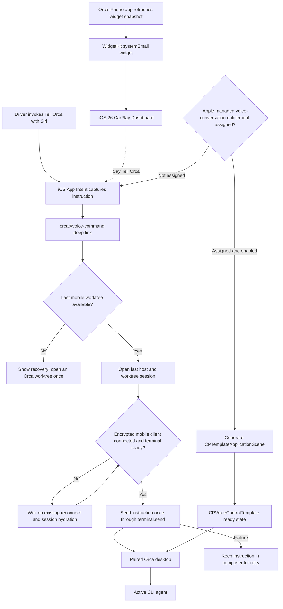

# Mobile voice and CarPlay integration

The first release exposes one narrow system action: **Tell Orca**. Siri captures an instruction,
opens Orca Mobile through its existing URL scheme, and sends the instruction to the terminal in the
last worktree visited on that phone. The existing mobile transport remains the only network and
encryption implementation.

## Current boundaries

- The desktop must be running and reachable through Orca's existing LAN or relay path.
- Siri launches the mobile app because the App Intent intentionally reuses the React Native session
  and encrypted transport rather than duplicating credentials or protocol code in Swift.
- The instruction is sent once per App Intent request ID. A failed send remains in the composer for
  manual retry.
- The `systemSmall` WidgetKit target is generated by Expo's SDK 55 `expo-widgets` plugin. On iOS 26
  it is eligible for CarPlay Dashboard and reminds the driver to invoke the existing Siri action.
- Apple assigned the managed CarPlay Voice Based Conversation capability on July 22, 2026. The
  config plugin now enables `OrcaCarPlaySceneDelegate`, generates the CarPlay scene manifest, and
  adds `com.apple.developer.carplay-voice-based-conversation` to the app entitlements together.

## Apple entitlement request draft

- **Product:** Orca Voice is the iOS companion to Orca Desktop. It lets a driver speak an
  instruction to the agent running in the last active paired Orca worktree and receive a concise
  spoken status or response without handling the phone.
- **Voice features:** The CarPlay experience is voice-first and uses Apple's voice-control template
  to show only Ready, Listening, Processing, and Responding state. The instruction travels through
  Orca Mobile's existing encrypted session to the paired desktop agent. It does not expose text
  entry, arbitrary app UI, web content, or images in response to a request, and it holds the audio
  session only while a conversation is active.
- **Bundle ID:** `com.carter.orcavoice`
- **Availability:** Internal TestFlight; no public App Store URL yet.
